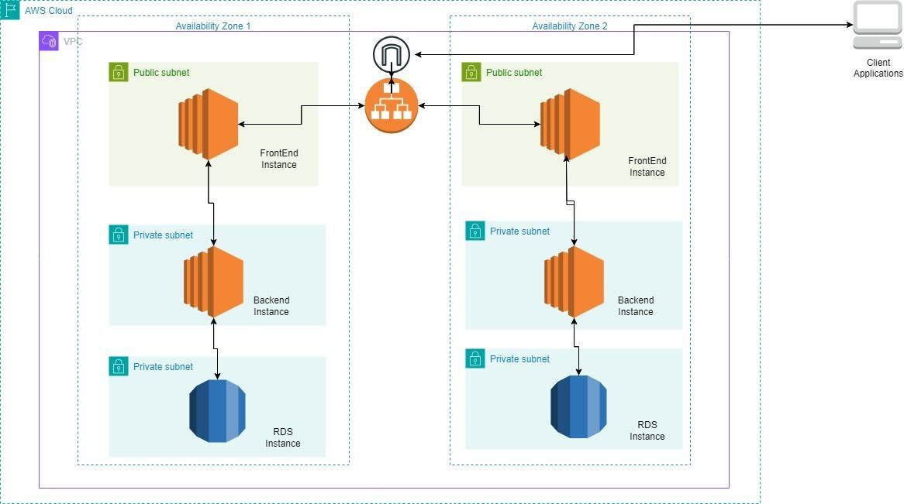

# AWS CDK Project

## Introduction

This project uses the AWS Cloud Development Kit (CDK) to define and deploy AWS infrastructure as code. It includes multiple environments, each specified in the `parameters.json` file.

## Prerequisites

Before you begin, ensure you have the following installed on your machine:

- Node.js and npm (Node Package Manager)
- AWS CDK: `npm install -g aws-cdk`

## Project Structure


    ts-aws-cdk-multitier-deployment/
    |-- bin/
    | |-- main.ts // Main entry point for CDK app
    |-- lib/
    | |-- vpc-stack.ts // Stack definition for VPC
    | |-- backend-stack.ts // Stack definition for backend EC2 instance and RDS
    | |-- frontend-stack.ts // Stack definition for frontend EC2 instance and ALB
    |-- test/
    | |-- main.test.ts // Tests for CDK project
    |-- cdk.json // CDK app configuration
    |-- package.json // Node.js project configuration
    |-- tsconfig.json // TypeScript compiler configuration
    |-- parameters.json // Configuration parameters

## Architecture of the AWS components to be deployed
Following is the architecture diagram of the components that are going to be deployed as part of deployment code.




## Build, Deploy and Cleanup Steps

1. **Install Dependencies:**
   
   Install project dependencies and trigger the build.

   ```bash
   npm install
   npm run build

2. **Build the CDK App:**

    Build the AWS CDK app.

    ```bash
    cdk synth --app="node dist/bin/main.js dev"

3. **Deploy for a Specific Environment:**

    Deploy the CDK stacks for a specific environment. Replace prod with the desired environment name.

    ```
    npm run deploy -- --app="node dist/bin/main.js dev" --env=dev
    ```
    You can run all of the steps from 1-3, by running deploy.sh file.

4. **Cleanup (Optional) for a Specific Environment:**

    Remove the deployed resources for a specific environment. Adjust the environment name (prod in this example).

    ```
    cd bin
    npm run destroy --  --app="node dist/bin/main.js dev" --env=dev
    ```

    Step 4 can be run run by running ./destroy.sh file.
## Notes

* Validate the provided environment against the ones defined in your parameters.json file.
* Review and customize the parameter values in parameters.json based on your project requirements.
